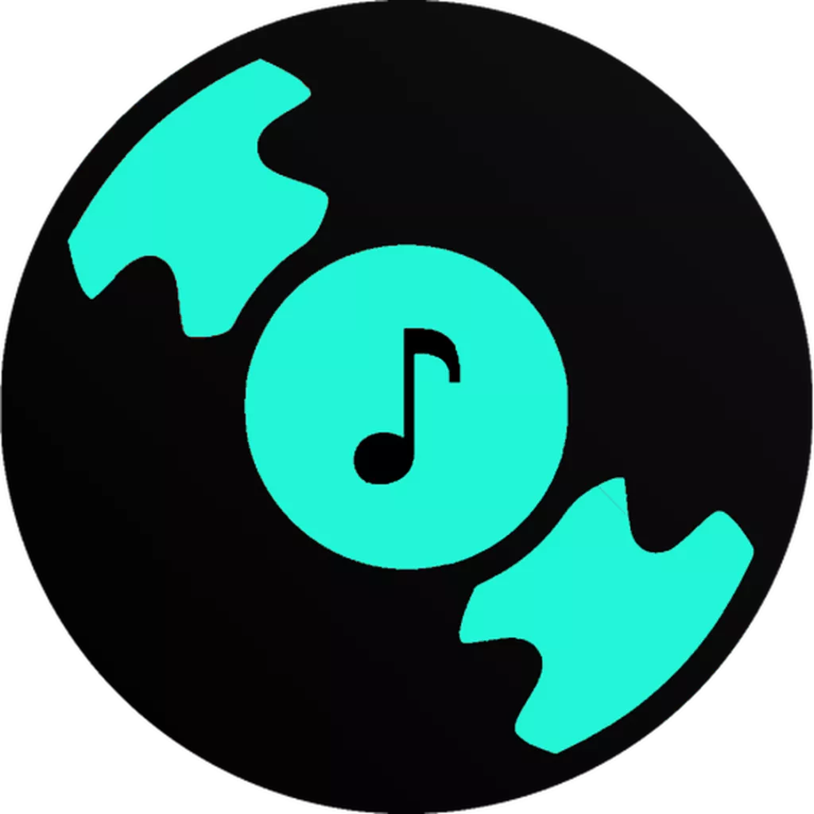

<h1 align="center"> Musicous </h1>

## ✨Latest Updates
Discord.js v13 will break this bot so do not use this with it. We have been started working on [v5](https://github.com/MrVenomYT/Musicous/tree/v5) which will be out in some days/months with new features and much more are on the way.

## 🚧 Prerequisites 

- [Node.js 14+](https://nodejs.org/en/download/)
- [discord.js@12.5.3](https://www.npmjs.com/package/discord.js/v/12.5.3)
- [Lavalink Server](https://lavalink.darrennathanael.com/SSL/lavalink-with-ssl/)

> NOTE: Lavalink is needed for music functionality. You need to have a working Lavalink server to make the bot work.

## 📝 Tutorial

A Tutorial has been uploaded on YouTube, Watch it by clicking on the image down below 

## 📝 [Support Server](https://discord.gg/HEmshJuPXC)

If you have major coding issues with this bot, please join and ask for help.

## 💨 Run the projects

> Note: If you are hosting your bot in heroku, Please consider upgrading your dyno for running dashboard & bot simultaneously because in free dyno it'll run out of memory(as there are two workers). If you want to run only the bot, turn off the `web` dyno.

Made with :heart: and JavaScript!
